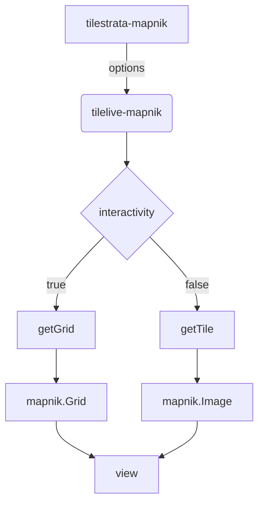

[tilestrata-mapnik](https://github.com/naturalatlas/tilestrata-mapnik)顾名思义，mapnik 作为地图数据源，tilestrata 负责瓦片化的一个插件。

<!--more-->

demo 项目可以参考[tilestrata-sample-code](https://github.com/zzcyrus/tilestrata-sample-code)

# 1. 安装

```bash
npm install mapnik --save
npm install tilestrata-mapnik --save
```

虽然最新的 mapnik4.0 已经支持了 nodejs 10 版本，这里仍然建议采用**nodejs 8** 环境，更为稳定，如果安装失败可以考虑切换到**nodejs 8**

# 2. 使用

准备好 mapnik 的 xml 配置文件

```js
var tilestrata = require("tilestrata");
var mapnik = require("tilestrata-mapnik");

server = tilestrata();

server
  .layer("layer_name")
  .route("tile.png")
  .use(
    mapnik({
      pathname: "style/china.xml"
    })
  );

server.listen(8080);
```

tilestrata-mapnik 支持的`options`有

```js
{
  interactivity: false,
  xml: null,
  pathname: null,
  metatile: 2,
  resolution: 4,
  bufferSize: 128,
  tileSize: 256,
  scale: 1
}
```

# 3. 效果

demo 项目可以参考[tilestrata-sample-code](https://github.com/zzcyrus/tilestrata-sample-code)


# 4. 代码浅析

插件会根据传入的`options`构建一个[tilelive-mapnik](https://github.com/mapbox/tilelive-mapnik)对象 source

```js
source = new MapnikBackend(options, function(err, result) {
  source = result;
  callback(err);
});
```

根据`options`里面`interactivity`的值，分别调用了下面两个函数，对数据源会做个是否满足调用条件的判断，如果满足就设置一下`options`里面数据`format`的值

```js
// interactivity为 false，设置 format为 png
source.getTile();

// interactivity为 true，设置 format为 utf
source.getGrid();
```

针对两种不同的`format`，分别创建 mapnik 实例

```js
// format为 png
image = new mapnik.Image();

// format为 utf
image = new mapnik.Grid();
```

在请求具体的某个 zxy 瓦片的时候，就使用 mapnik 获取指定瓦片的方法`view`就好了。

```js
image.view(x, y, width, height); // 获取指定瓦片
```

流程图


